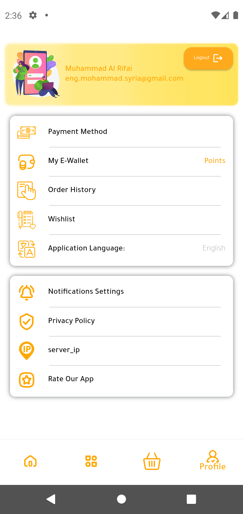

# Furniture Store - Mohammad AlRefaie - Bakri Furniture.

# 00971 56 756 1512 - UAE-Dubai


## Table of Contents

- [Screenshots](#screenshots)
- [Installation](#installation)
- [Usage](#usage)
- [Testing](#testing)

## Screenshots

<p align="center">
  
  
  
  
  
  
  
  
  
  
  
  
  
  
  
  
</p>

## Installation

To get started with this project, follow these steps:

1. **Clone the repository:**
   ```sh
   git clone https://github.com/your-username/task-management-system.git
   cd task-management-system
   ```


1. **Install dependencies:**

```sh
flutter pub get
```

1. **Run the app:**

```sh
flutter run
```

## Usage

After installing the app, you can use it as follows:

Login: Use the login screen to authenticate.
Manage Tasks: Create new tasks, view existing tasks, edit details of tasks, and delete tasks.
View Task Details: Click on a task to see its details.

## Testing

To run the tests for this project:

Navigate to the test folder:

```sh
cd test
```

Run the tests:

```sh
flutter test
```
